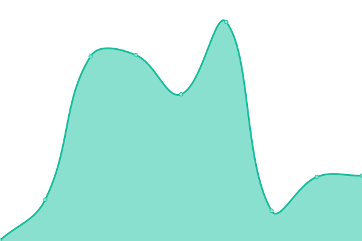
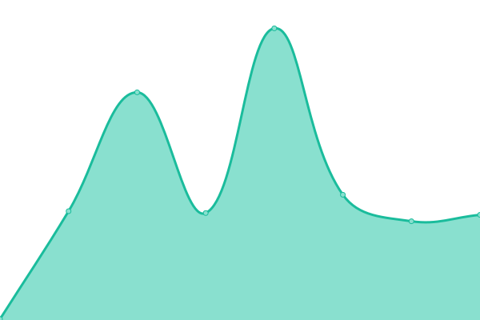

# [📈 Live Status](https://uefn.jok.dev): <!--live status--> **🟩 All systems operational**

This repository contains the open-source uptime monitor and status page for [Jok](https://uefn.jok.dev), powered by [Upptime](https://github.com/upptime/upptime).

With [Upptime](https://upptime.js.org), you can get your own unlimited and free uptime monitor and status page, powered entirely by a GitHub repository. We use [Issues](https://github.com/jok-dev/uefn-uptime/issues) as incident reports, [Actions](https://github.com/jok-dev/uefn-uptime/actions) as uptime monitors, and [Pages](https://uefn.jok.dev) for the status page.

<!--start: status pages-->
<!-- This summary is generated by Upptime (https://github.com/upptime/upptime) -->
<!-- Do not edit this manually, your changes will be overwritten -->
<!-- prettier-ignore -->
| URL | Status | History | Response Time | Uptime |
| --- | ------ | ------- | ------------- | ------ |
|  [UEFN Content Service](https://content-service.bfda.live.use1a.on.epicgames.com/) | 🟩 Up | [uefn-content-service.yml](https://github.com/jok-dev/uefn-uptime/commits/HEAD/history/uefn-content-service.yml) | 

 254ms
     
 | 

<a href="https://uefn.jok.dev/history/uefn-content-service">100.00%</a>
    

|  [Fortnite Datastorage](https://fn-service-datastorage-live-uefn-public.eeef.live.use1a.on.epicgames.com/) | 🟩 Up | [fortnite-datastorage.yml](https://github.com/jok-dev/uefn-uptime/commits/HEAD/history/fortnite-datastorage.yml) | 

 203ms
     
 | 

<a href="https://uefn.jok.dev/history/fortnite-datastorage">94.98%</a>
    

|  [Epic Launcher](https://launcher-public-service-prod06.ol.epicgames.com/launcher/api/public/distributionpoints) | 🟩 Up | [epic-launcher.yml](https://github.com/jok-dev/uefn-uptime/commits/HEAD/history/epic-launcher.yml) | 

 162ms
     
 | 

<a href="https://uefn.jok.dev/history/epic-launcher">100.00%</a>
    

<!--end: status pages-->

[**Visit our status website →**](https://uefn.jok.dev)

## 📄 License

- Powered by: [Upptime](https://github.com/upptime/upptime)
- Code: [MIT](./LICENSE) © [Anand Chowdhary](https://anandchowdhary.com), supported by [Pabio](https://pabio.com)
- Data in the `./history` directory: [Open Database License](https://opendatacommons.org/licenses/odbl/1-0/)
